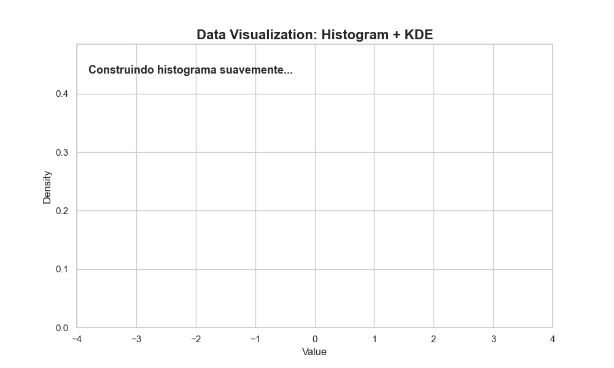

# Data Visualization Animada com Python

Este projeto demonstra a criação de visualizações de dados dinâmicas e envolventes utilizando Python, com foco em uma animação que ilustra a construção de um histograma e a suavidade de uma Curva de Densidade de Kernel (KDE). É uma ferramenta ideal para apresentações, posts em mídias sociais ou portfólios, transformando dados estáticos em uma narrativa visual impactante.

## 🚀 Demonstração

Confira a animação gerada por este projeto:

<p align="center">
  
</p>

## 🎯 Objetivo

O principal objetivo é elevar a experiência da visualização de dados, transformando gráficos tradicionais em animações interativas que capturam a atenção e facilitam a compreensão de padrões e distribuições em conjuntos de dados.

## ✨ Como a Animação Funciona

A animação é composta por duas fases distintas, cada uma revelando progressivamente os elementos do gráfico:

1.  **Histograma Animado:** As barras do histograma crescem suavemente, uma por uma, até atingirem suas alturas finais, representando a frequência dos dados em cada bin.
2.  **Curva KDE Progressiva:** Após a formação do histograma, uma Curva de Densidade de Kernel (KDE) emerge gradualmente da esquerda para a direita, revelando a estimativa de densidade de probabilidade subjacente aos dados.
3.  **Texto Dinâmico:** Um texto contextual aparece e muda ao longo da animação, guiando o espectador através do processo de construção do gráfico e dos insights apresentados.

---

## 🛠️ Tecnologias Utilizadas

* **Python 3.x:** Linguagem de programação principal.
* **`matplotlib`:** Para a criação dos gráficos estáticos e a funcionalidade de animação.
* **`seaborn`:** Utilizado para o estilo estético e aprimoramento visual das plotagens.
* **`numpy`:** Essencial para manipulação numérica e geração dos dados de exemplo.
* **`scipy`:** Em particular, a função `gaussian_kde` para o cálculo da Curva de Densidade de Kernel.
* **`Pillow`:** Necessário para a exportação da animação final em formato GIF.

## 🚀 Instalação e Uso

Para reproduzir este projeto e gerar a animação, siga os passos abaixo:

1.  **Clone o repositório:**
    ```bash
    git clone [https://github.com/SeuUsuario/Projeto_Data_Visualization_Animada.git](https://github.com/SeuUsuario/Projeto_Data_Visualization_Animada.git)
    cd Projeto_Data_Visualization_Animada
    ```
    *(**Atenção**: Substitua `SeuUsuario` pelo seu nome de usuário no GitHub se ainda não tiver feito o push para o seu próprio repositório.)*

2.  **Crie e ative um ambiente virtual (recomendado):**
    ```bash
    python -m venv venv
    # No Windows:
    .\venv\Scripts\activate
    # No Linux/macOS:
    source venv/bin/activate
    ```

3.  **Instale as dependências:**
    ```bash
    pip install -r requirements.txt
    ```

4.  **Execute o Notebook Jupyter:**
    Abra o notebook `Projeto_Data_Visualization_Animada.ipynb` com Jupyter Lab ou Jupyter Notebook e execute todas as células. Isso irá gerar a animação e salvá-la na pasta `media/`.
    ```bash
    jupyter notebook Projeto_Data_Visualization_Animada.ipynb
    ```
    Certifique-se de que a pasta `media` existe na raiz do seu projeto para salvar o GIF. Se não existir, crie-a: `mkdir media`.

## 📄 Licença

Este projeto está licenciado sob a Licença MIT. Para mais detalhes, consulte o arquivo [LICENSE.md](LICENSE.md) na raiz do repositório.

## 🤝 Contato

Sinta-se à vontade para entrar em contato para dúvidas, sugestões ou colaborações:

* **Nome:** Flávio Henrique Barbosa
* **LinkedIn:** [Flávio Henrique Barbosa | LinkedIn](https://www.linkedin.com/in/fl%C3%A1vio-henrique-barbosa-38465938)
* **Email:** flaviohenriquehb777@outlook.com